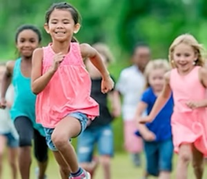

# Aktiviteter

I MUIL tilbyr vi et variert aktivitetstilbud for alle aldre og ferdighetsnivåer. Her kan du finne informasjon om de ulike aktivitetene vi tilbyr, inkludert tidspunkter, steder og kontaktpersoner.
Vi oppfordrer alle medlemmer til å delta i aktivitetene og bli kjent med hverandre.

Enten du er nybegynner eller erfaren, er det alltid noe for deg i MUIL!

&nbsp;&nbsp;&nbsp;&nbsp;&nbsp;&nbsp;

  

    <a href="/muil/aktiviteter/fotball">
      
      
Fotball

    </a>
  

  

    <a href="/muil/aktiviteter/frisbeegolf">
      
      
Frisbeegolf

    </a>
  

  

    <a href="/muil/aktiviteter/innebandy">
      
      
Innebandy

    </a>
  

  

    <a href="/muil/aktiviteter/ski">
      
      
ski

    </a>
  

  

    <a href="/muil/aktiviteter/volleyball">
      
      
Volleyball

    </a>
  

  

    <a href="/muil/aktiviteter/barneidrett">
      
      
Barneidrett

    </a>
  

  

    <a href="/muil/aktiviteter/bli-sterk">
      
      
Bli sterk

    </a>
  

  

    <a href="/muil/aktiviteter/leikarring">
      
      
Leikarring

    </a>
  

  

    <a href="/muil/aktiviteter/klubb">
      
      
Klubb

    </a>
  

