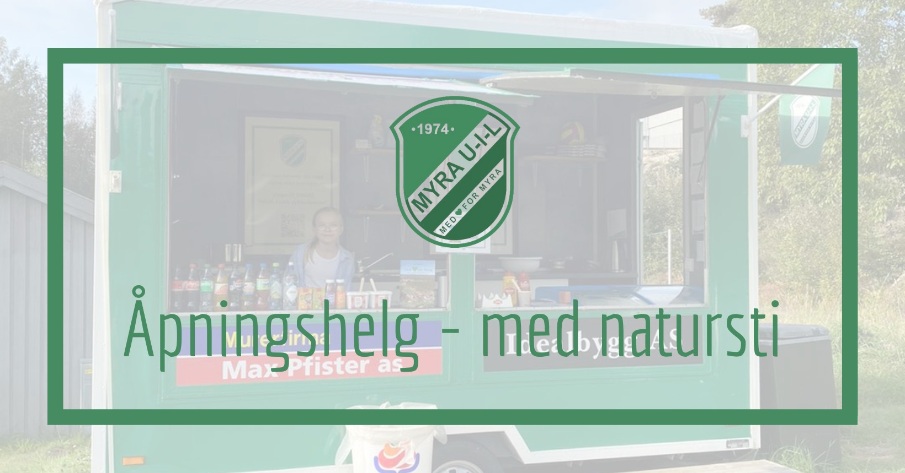
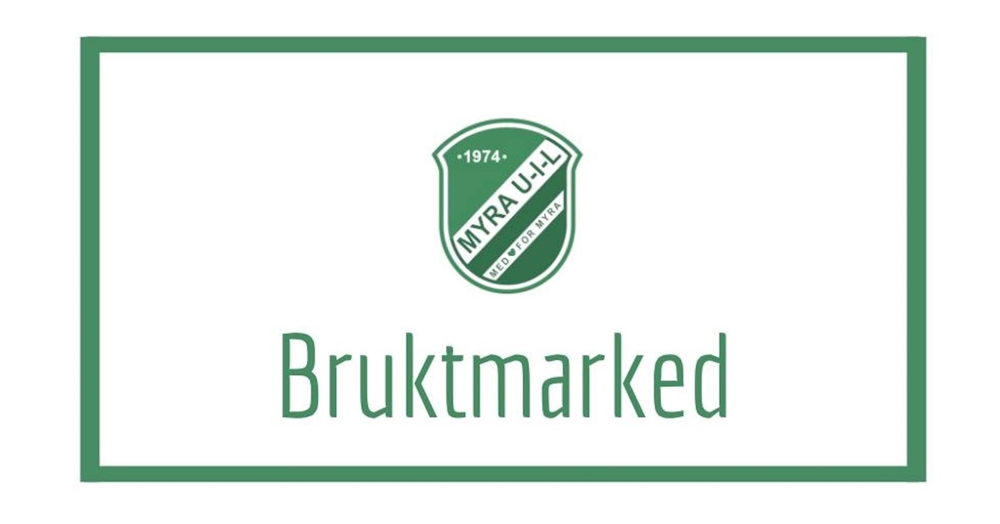
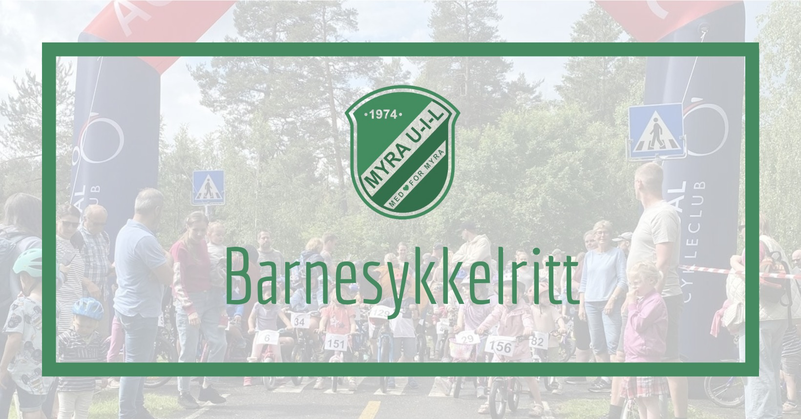
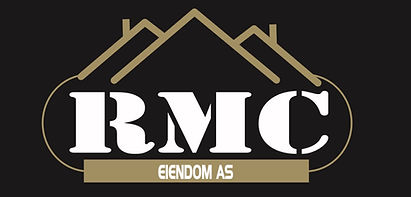
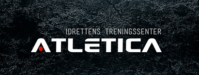

---
hide:
  - navigation
---

# Velkommen til Myra Ungdoms- og Idrettslag (MUIL)!

MUIL er et idrettslag for alle, og vi ønsker å skape et inkluderende og aktivt miljø for våre medlemmer. Her finner du informasjon om våre aktiviteter, medlemskap og kommende arrangementer.

## Kommende arrangementer

Vi har mange spennende arrangementer planlagt fremover! Her er noen av dem:

<!-- prettier-ignore -->

  

    <a href="https://fb.me/e/59qMDdybH">
      
      <h3 style="margin: 0;">Åpningshelg i kioskvogna</h3>
      <h4 style="margin-bottom: 0;">Natursti med premie!</h4>
      
<strong>Dato:</strong> Lørdag 5. april

      
<strong>Tid:</strong> 11:00 - 16:00

      
<strong>Sted:</strong> Myra Sykkelgård

    </a>
  

  

    <a href="https://fb.me/e/4uj0UzEiL">
      
      <h3 style="margin: 0;">Åpningshelg i kioskvogna</h3>
      <h4 style="margin-bottom: 0;">Natursti med premie!</h4>
      
<strong>Dato:</strong> Søndag 6. april

      
<strong>Tid:</strong> 11:00 - 16:00

      
<strong>Sted:</strong> Myra Sykkelgård

    </a>
  

  

    <a href="https://fb.me/e/4jKLKoUT7">
      
      <h3 style="margin: 0;">Bruktmarked på grendehuset</h3>
      <h4 style="margin-bottom: 0;">En langfredag fylt med skatter og hygge!</h4>
      
<strong>Dato:</strong> Fredag 18. april

      
<strong>Tid:</strong> 11:00

      
<strong>Sted:</strong> Myra Grendehus

    </a>
  

  

    <a href="https://fb.me/e/61Gz2h9FP">
      
      <h3 style="margin: 0;">Gratis sykkelritt</h3>
      <h4 style="margin-bottom: 0;">For barn 1-12 år</h4>
      
<strong>Dato:</strong> Lørdag 24. mai

      
<strong>Tid:</strong> 11:00 - 13:30

      
<strong>Sted:</strong> Myra Sykkelgård

    </a>
  

## Sponsorer

**Vi takker våre støttespillere, og håper du vil støtte dem!**

<!-- Hvis du vil sponse MUIL - kontakt oss på {{ email.sponsor }} for mer informasjon. -->

Hvis du vil sponse MUIL - kontakt oss på [email](mailto:{{ email.sponsor }}) for mer informasjon.

{ align=left }

{ align=center }

{ align=center }
