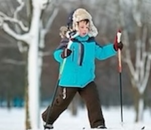
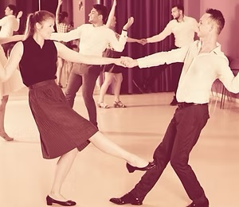

# AKTIVITETSTILBUD I MUIL

<!-- prettier-ignore -->
!!! warning
    Dette er kastet i sammen på ca en times tid. Jeg kan gjøre mye mere uta dette.

!!! info inline end "Til Maria"

    Ta en kikke på kategoriene, men ikke tenk at jeg har gjort dette spesielt ryddig eller fancy. Dette er bare for å vise deg at det er mulig å gjøre dette ganske billig og enkelt.

Vi kan f.eks legge til mere utdypende informasjon, (1) Klikk på meg for å se mer.

1.  :man_raising_hand: Hei! Jeg er veldig mye mere utdypende informasjon!!!

  

    <a href="/muil/docs/aktiviteter/barneidrett.md">
      
      
BARNEIDRETT

    </a>
  

  

    <a href="/muil/docs/aktiviteter/klubbkvelder.md">
      
      
KLUBBKVELDER

    </a>
  

  

    <a href="/muil/docs/aktiviteter/innebandy.md">
      
      
INNEBANDY

    </a>
  

  

    <a href="/muil/docs/aktiviteter/bli-sterk.md">
      
      
BLI STERK

    </a>
  

  

    <a href="/muil/docs/aktiviteter/fotball.md">
      
      
FOTBALL

    </a>
  

  

    <a href="/muil/docs/aktiviteter/ski.md">
      
      
SKI

    </a>
  

  

    <a href="/muil/docs/aktiviteter/leikarring.md">
      
      
LEIKARRING

    </a>
  

  

    <a href="/muil/docs/aktiviteter/frisbeegolf.md">
      
      
FRISBEEGOLF

    </a>
  

  

    <a href="/muil/docs/aktiviteter/volleyball.md">
      
      
VOLLEYBALL

    </a>
  

