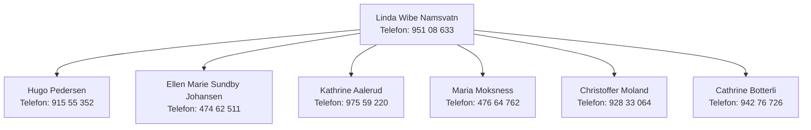

# HOVEDSTYRET

Praktisk informasjon og kontaktinformasjon for leie av Myra grendehus finner du her.

## Styrediagram

## Leder

**Linda Wibe Namsvatn**  
Telefonnummer: 951 08 633  
E-post

## Nestleder

**Hugo Pedersen**  
Telefonnummer: 915 55 352  
E-post

## Kasserer

**Ellen Marie Sundby Johansen**  
Telefonnummer: 474 62 511  
E-post

## Medlemsansvarlig

**Kathrine Aalerud**  
Telefonnummer: 975 59 220  
E-post

## Web, SoMe og kommunikasjon

**Maria Moksness**  
Telefonnummer: 476 64 762  
E-post

## Styremedlem

**Christoffer Moland**  
Telefonnummer: 928 33 064  
E-post

## Styremedlem

**Cathrine Botterli**  
Telefonnummer: 942 76 726  
E-post

---

## Andre kontaktpersoner

### Vaktmester og anleggsleder

**Kenneth Johansen**  
Telefonnummer: 481 76 418  
E-post

### Miljøgruppa

**Kirsten Helene Jacobsen**  
Telefonnummer: 900 66 325  
E-post

### Leder leikarringen

**Magne Blågestad**  
Telefonnummer: 924 13 595  
E-post

### Leder fotballgruppa

**Bengt-Ove Madsen**  
Telefonnummer: 951 55 667  
E-post

### Fotballens sportslige utvalg

**Leder: Kristine Reiersen**  
Telefonnummer: 911 60 781  
E-post

Utvalget består i tillegg av disse medlemmene:

- Eirill Olsen
- Reidar Sandåker
- Bengt-Ove Madsen
- Preben Rønningen
- Hugo Pedersen

### Leder ungdomsklubb

**Cathrin Bjørnsen**  
Telefonnummer: 917 34 166  
E-post

### Leder barneklubb

**Lewi Lie Uberg**  
Telefonnummer: 950 02 946  
E-post

### Leder skigruppa

**Aslak Blågestad**  
Telefonnummer: 905 31 112  
E-post

### Leder barneidretten

**Preben Rasmus Kojan**  
Telefonnummer: 950 36 144  
E-post

### Leder styrketrening "Bli sterk"

**Kirsten Helene Jacobsen**  
Telefonnummer: 900 66 325  
E-post

### Leder innebandy

**Kenneth S. Holst**  
Telefonnummer: 976 62 592  
E-post

### Leder volleyball

**Bjørn Løvjomås**  
Telefonnummer: 472 63 006  
E-post

### Leder frisbeegolf

**Gjermund Hurvenes**  
Telefonnummer: TBA  
E-post

---

## Valgkomiteen

- **Marte B. Fossestøl (leder)**  
  E-post
- **Ole Michael Namsvatn (medlem)**
- **Suzanna Henriksen-Skarli (medlem)**

---

## Politiattest

Alle med styre- og/eller trenerverv i MUIL skal levere oppdatert politiattest. Norges idrettsforbund jobber kontinuerlig for at idretten skal være et trygt og godt sted for alle medlemmer. Som en viktig del av dette arbeidet skal alle som utfører oppgaver i norsk idrett, som innebærer et ansvars- eller tillitsforhold overfor mindreårige eller personer med utviklingshemming, fremvise politiattest (barneomsorgsattest).

Les mer om hvorfor det kreves politiattest og hvordan man søker om dette på idrettsforbundets nettsider.

---
